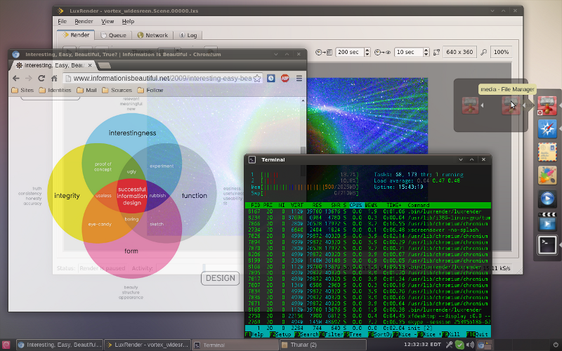

Dust Glx-Dock Theme
=======================================================================

Dust theme for Glx-Dock (aka Cairo-Dock) has been carefully designed to bridge the best of many worlds:

* The desktop clarity and simplicity offered by the Dust desktop theme

* The consistent and strong associations between functions and their graphical representations, polished by the Faenza icon theme

* The unobtrusive flexibility of Glx-Dock

and bring them together to your professional *NIX desktop in a consistent manner.



Screenshot of an XFCE desktop with the Dust theme and Glx-Dock.

#Table of contents

1. Prerequisites

2. Install

3. Upgrade

6. Uninstall

7. Further reading

8. Credits

9. Legal notices

#Prerequisites

To achieve the effect intended by the Dust theme for Glx-Dock, you will need the following free software and artwork installed and configured:

- *NIX OS with a desktop environment

- Glx-Dock version 3.0.0 or newer: http://glx-dock.org/

- Dust theme for Ubuntu by Rico Sta. Cruz, Kido Mariano, and James Schriver: https://wiki.ubuntu.com/Artwork/Incoming/DustTheme

- Faenza icon theme by thieum: http://tiheum.deviantart.com/art/Faenza-Icons-173323228

- (optionally) Chocolate-milk gradient desktop wallpaper like: http://www.deviantart.com/morelikethis/332464624

- Git&trade; core client: http://git-scm.com/downloads

Probably most of the items referenced above are already available through your *NIX OS distribution channels. The URLs are provided for your convenience, whether you choose to look for any bleeding-edge versions.

#Install

Once the prerequisites above are met, in order to install the Dust theme for Glx-Dock, execute the following statement in Terminal:

```
git clone https://github.com/bogomirov/glx-dock-bluebird-theme.git \
~/.config/cairo-dock/themes/Dust
```

Note that installing the theme does not immediately affect the appearance of Glx-Dock. In order to actually **use** the theme, you should apply it through the Glx-Dock Theme Manager.

#Upgrade

Once installed by completing the step above, the Dust theme for Glx-Dock can be upgraded by executing the following statements in Terminal:

a) Switch to the folder where the Dust theme for Glx-Dock is installed:

```
  cd ~/.config/cairo-dock/themes/Dust
```

b) Upgrade the theme with the latest changes from the GitGub repo:

```
  git pull origin master
```

Similarly, upgrading the theme this way does not immediately affect the appearance of Glx-Dock. In order to actually **use** the new version, you should re-apply the theme through the Glx-Dock Theme Manager.

#Uninstall

To uninstall the Dust theme from the Glx-Dock Theme Manager, open Terminal and execute:

```
rm -rf ~/.config/cairo-dock/themes/Dust
```

Note that removing the theme from the Glx-Dock Theme Manager does not alter the current appearance of Glx-Dock. In order to accomplish that also, you should either select another theme, or alter the appearance/configuration of Glx-Dock manually.

Furthermore, removing the theme will **irrecoverably delete** the history of all modifications you have made. Therefore it is advisable to consider keeping an archive of your work elsewhere.

#Further reading

For information about the concept behind this project and how to easily modify and share it online, please see the Bluebird Glx-Dock Theme project: https://github.com/bogomirov/glx-dock-bluebird-theme

#Credits

This project utilizes code and/or artwork from the following sources:

* The Glx-Dock project: http://glx-dock.org/

* Faenza icon theme by thieum: http://tiheum.deviantart.com/art/Faenza-Icons-173323228

* Faience icon theme by thieum: http://tiheum.deviantart.com/art/Faience-icon-theme-255099649

* Faenza-Xfce icon theme by the Shimmer project: https://github.com/shimmerproject/Faenza-Xfce

* Geany icon for the Faenza theme by Colomban Wendling: https://github.com/b4n/geany-faenza-icon

* Xfce4.8 Panel BGs 1920x28 by kazu-spara: http://kazu-spara.deviantart.com/art/Xfce4-8-Panel-BGs-1920x28-267098524

#Legal notices

Git is a trademark of Software Freedom Conservancy, Inc.

Copyright on the project concept, theme design, the specific Glx-Dock configuration and some of the digital artwork &copy; 2014, Bogomir Bogomirov.

This theme is licensed under GPL version 3. See [LICENSE](LICENSE) file for details.


